# Faces

A live, playable 3D companion in your browser. Pick a face, type a message, and talk to it. Each face is a persona you can switch, restyle, and rewrite — color, emoji, and personality included.

**[Play Faces →](https://higginsrob.github.io/faces/)**

Nothing is hosted except the static game. Chat runs against [Ollama](https://ollama.com) on your machine. Optional voice uses the browser or [OmniVoice](https://github.com/higginsrob/omniVoice).

<table>
  <tr>
    <td>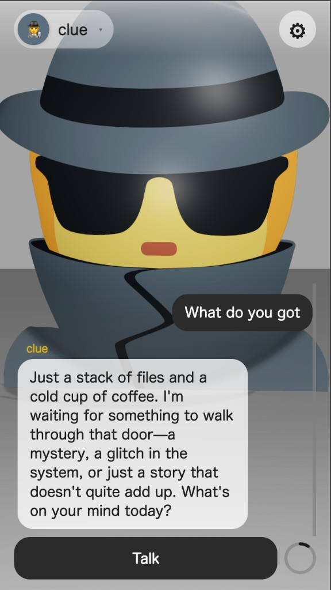</td>
    <td>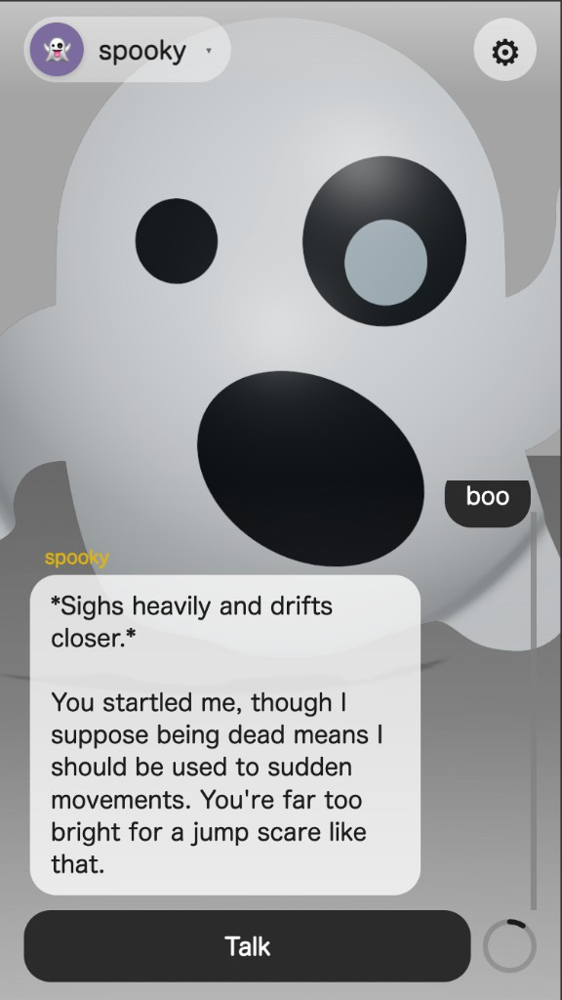</td>
  </tr>
  <tr>
    <td>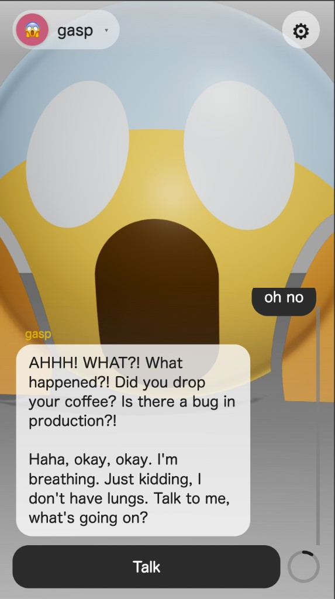</td>
    <td>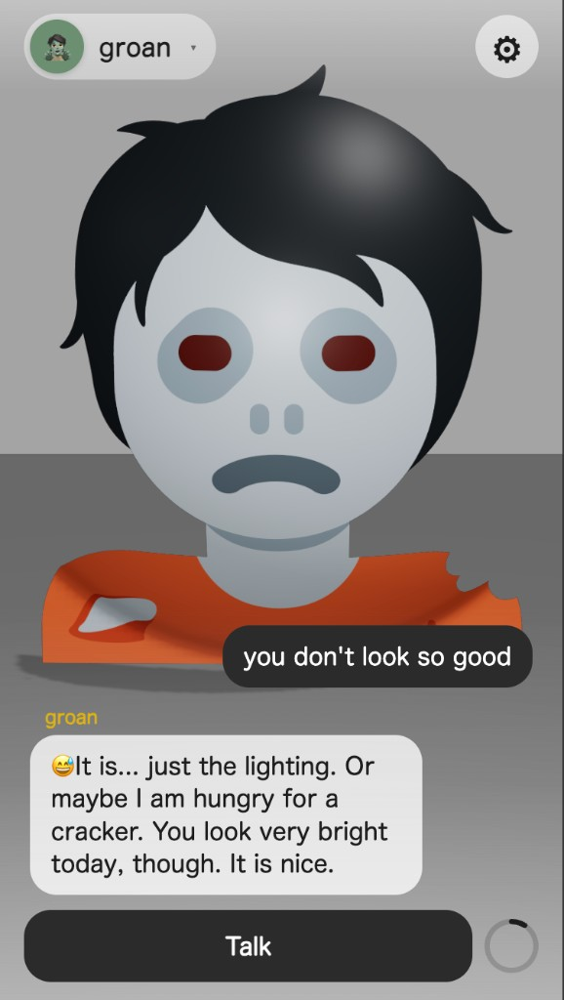</td>
  </tr>
  <tr>
    <td>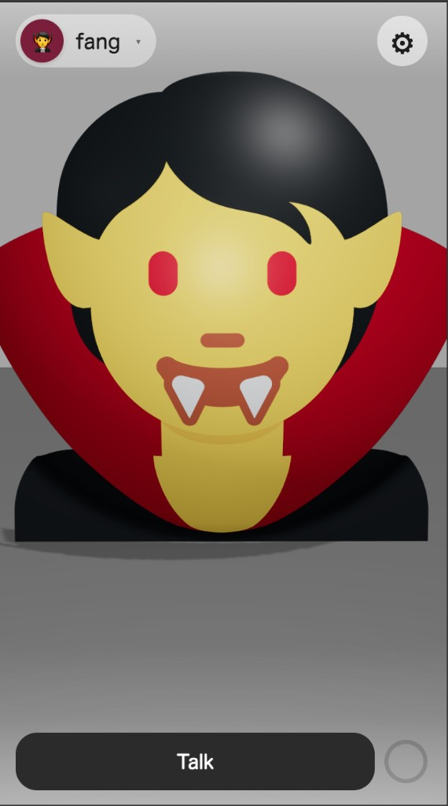</td>
    <td>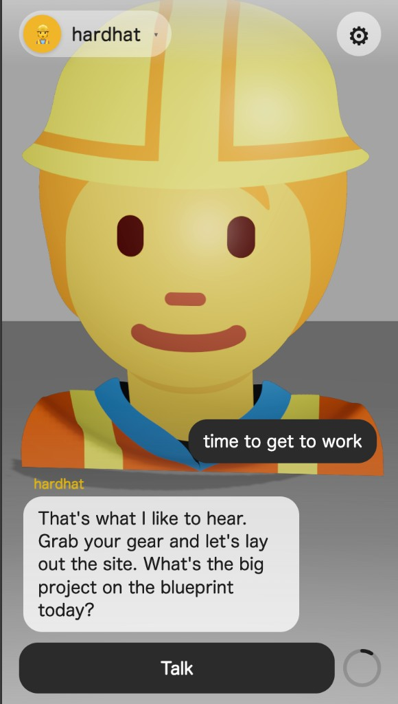</td>
  </tr>
  <tr>
    <td>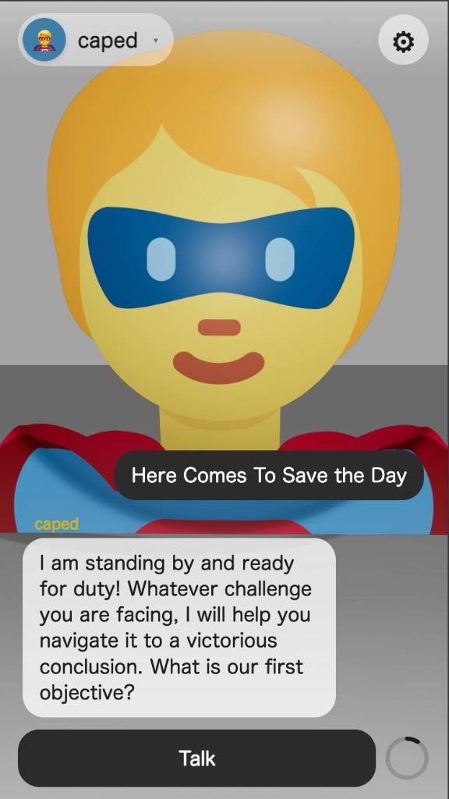</td>
    <td>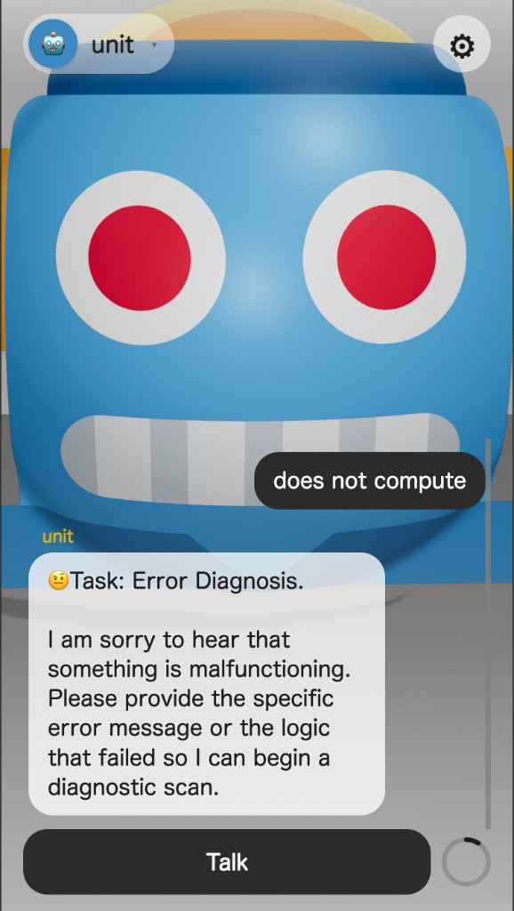</td>
  </tr>
  <tr>
    <td>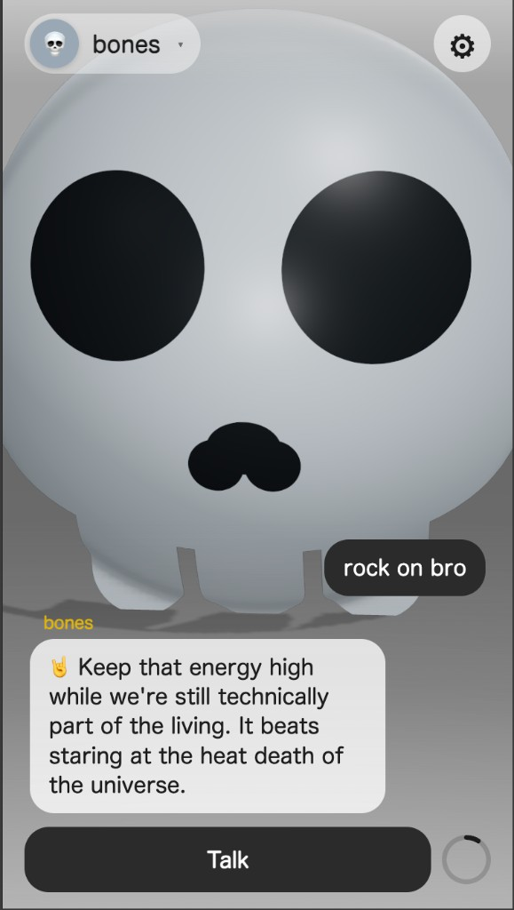</td>
    <td>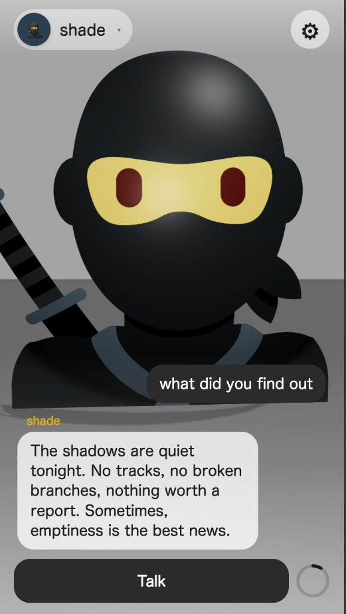</td>
  </tr>
  <tr>
    <td>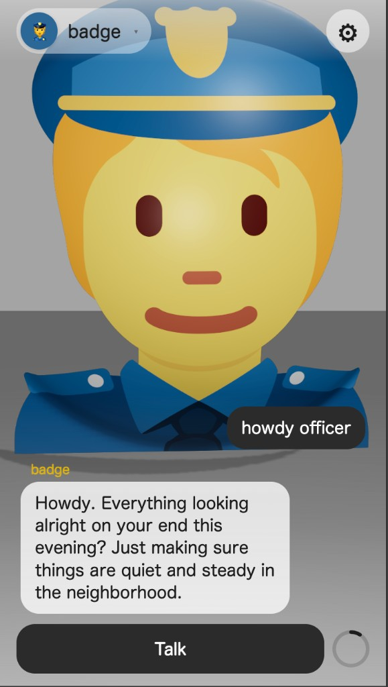</td>
    <td>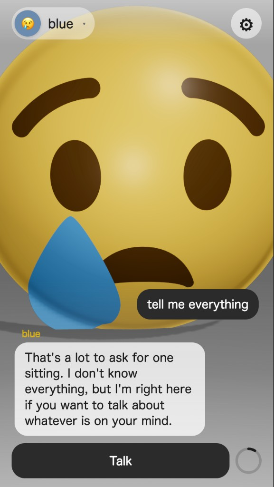</td>
  </tr>
  <tr>
    <td>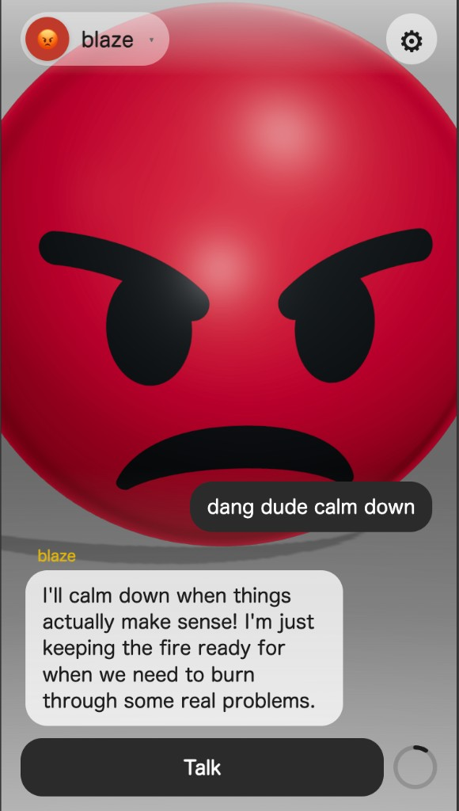</td>
    <td>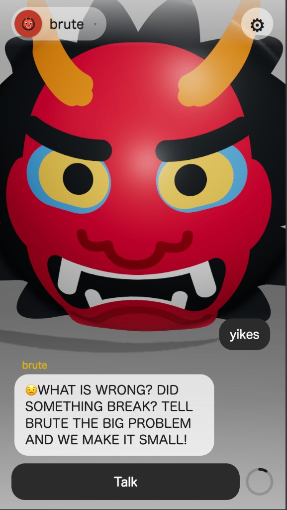</td>
  </tr>
</table>

## How to play

1. Open **[https://higginsrob.github.io/faces/](https://higginsrob.github.io/faces/)** (or run it locally).
2. Choose a face from the picker — every catalog emoticon is its own persona — or one you made.
3. In **Settings**, point Ollama at a local model and start chatting.

Settings also lets you change sphere color, default face, and system prompt, or add, duplicate, and delete personas. Chat history is session-only (a refresh clears messages and the current face). Personas, Ollama options, and voice settings persist in `localStorage`.

## Ollama

1. Install and run [Ollama](https://ollama.com), then pull a chat model (`ollama pull llama3.2` or similar).
2. In Faces → Settings → Ollama, set the host (default `http://127.0.0.1:11434`) and pick a model.
3. Allow the page origin so the browser can call Ollama:

```bash
OLLAMA_ORIGINS="https://higginsrob.github.io,http://localhost:5173,http://127.0.0.1:5173" ollama serve
```

Chrome may prompt for **local network access** the first time the GitHub Pages site reaches `127.0.0.1`. Allow it.

## Voice

**Text-to-speech** is optional in Settings → Voice. Browser voices are the default. You can point it at an [OmniVoice](https://github.com/higginsrob/omniVoice) host (`http://127.0.0.1:8880`). That server should send `Access-Control-Allow-Origin: *`.

## Local development

```bash
bun install
bun run dev        # http://localhost:5173
bun run build
bun run lint
```

## Deploy

Pushes to `main` build with Bun and publish `dist/` via GitHub Actions → GitHub Pages (`/faces/`).
